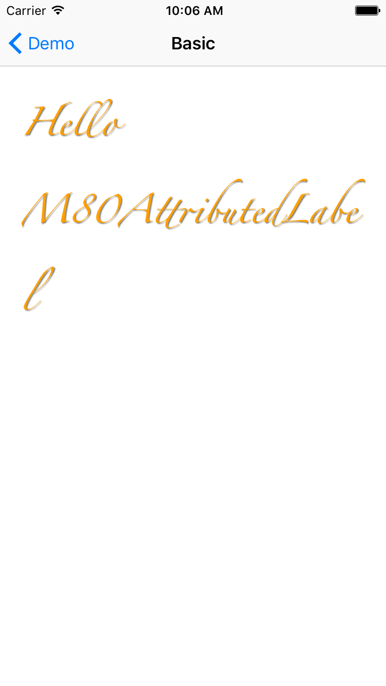
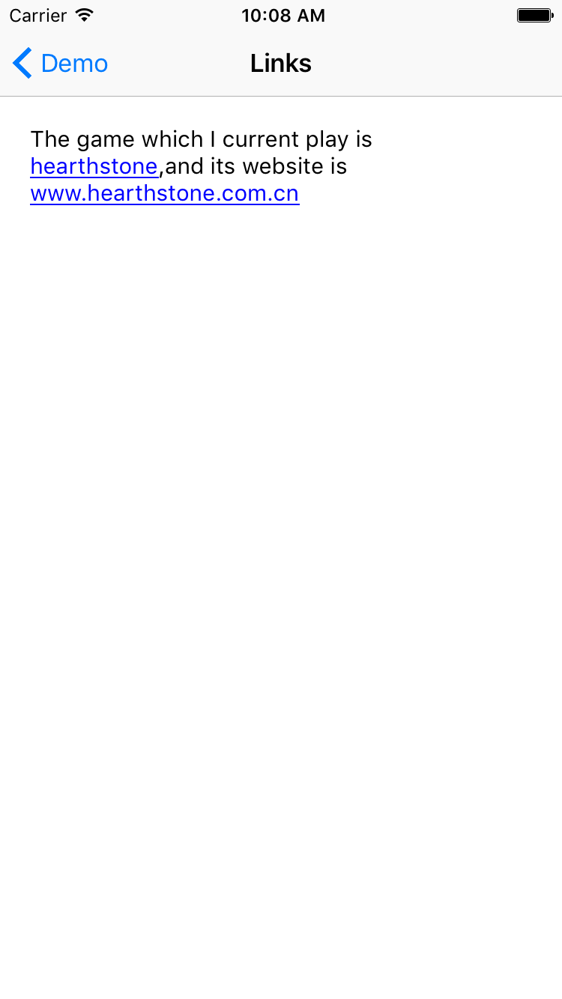
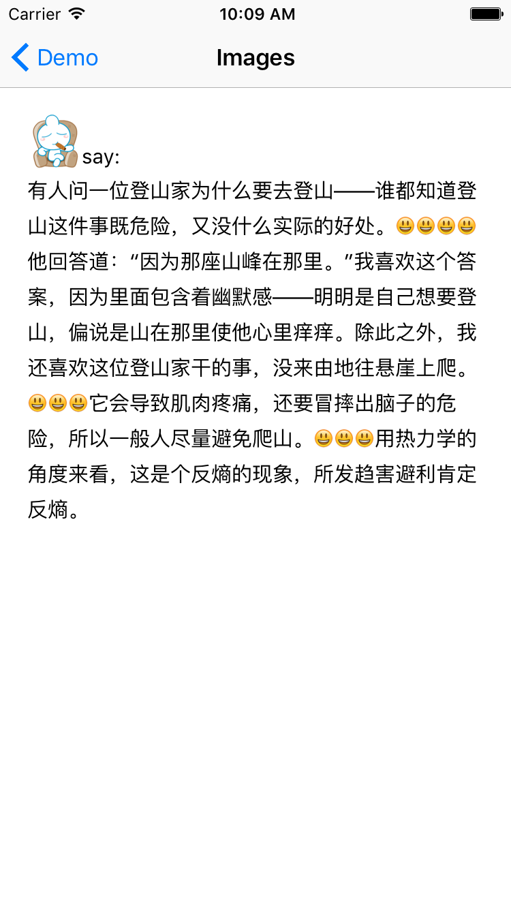
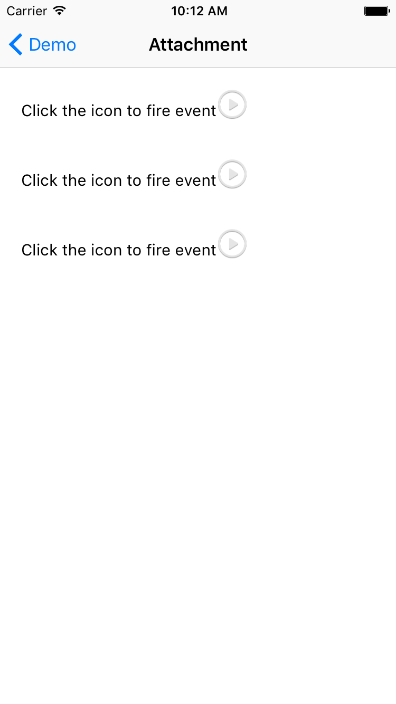

M80AttributedLabel
==================


富文本显示组件 [英文版本](./../README.md)


# 特性
* 支持多行富文本显示
* 支持链接自动检测和自定义链接添加
* 支持内嵌图片和控件
* 支持如下属性
    * `字体`
    * `文本颜色`
    * `高亮颜色`
    * `链接颜色`
    * `链接下划线`
    * `多行显示` (支持最后行尾部省略)
    * `文字对齐`
    * `换行模式`
    * `行间距`
    * `段落间距`
    * `阴影色`
    * `阴影偏移`
    * `阴影半径`

    

# 系统要求
* iOS 7.0 及以上
* 需要 ARC

# 集成

### Podfile

```ruby
pod 'M80AttributedLabel'
```

### 手动集成

* `git clone https://github.com/xiangwangfeng/M80AttributedLabel.git`
* 拷贝 `Class/M80AttributedLabel` 中的源代码到你的工程中
* 添加 `CoreText.framework` 

# 使用方法

## 基本使用

```objc

M80AttributedLabel *label = [[M80AttributedLabel alloc]initWithFrame:CGRectZero];
    
label.text      = @"Hello M80AttributedLabel";
label.font      = [UIFont fontWithName:@"Zapfino" size:25];
label.textColor = M80RGB(0xFF9F00);
label.shadowColor = [UIColor grayColor];
label.shadowOffset= CGSizeMake(1, 1);
label.shadowBlur = 1;
    
label.frame     = CGRectInset(self.view.bounds,20,20);

[self.view addSubview:label];
   
```



## 链接

```objc

M80AttributedLabel *label = [[M80AttributedLabel alloc]initWithFrame:CGRectZero];
    
NSString *text  = @"The game which I current play is hearthstone,and its website is www.hearthstone.com.cn";
NSRange range   = [text rangeOfString:@"hearthstone"];
label.text      = text;
[label addCustomLink:[NSValue valueWithRange:range]
            forRange:range];
label.delegate = self;
    
label.frame     = CGRectInset(self.view.bounds,20,20);

[self.view addSubview:label];


```




## 图片

```objc


M80AttributedLabel *label = [[M80AttributedLabel alloc]initWithFrame:CGRectZero];
label.lineSpacing = 5.0;
    
[label appendImage:[UIImage imageNamed:@"avatar"] 
		    maxSize:CGSizeMake(40, 40)
       	  margin:UIEdgeInsetsZero
 	      alignment:M80ImageAlignmentBottom];
    
NSString *text  = @"say:\n有人问一位登山家为什么要去登山——谁都知道登山这件事既危险，又没什么实际的好处。[haha][haha][haha][haha]他回答道：“因为那座山峰在那里。”我喜欢这个答案，因为里面包含着幽默感——明明是自己想要登山，偏说是山在那里使他心里痒痒。除此之外，我还喜欢这位登山家干的事，没来由地往悬崖上爬。[haha][haha][haha]它会导致肌肉疼痛，还要冒摔出脑子的危险，所以一般人尽量避免爬山。[haha][haha][haha]用热力学的角度来看，这是个反熵的现象，所发趋害避利肯定反熵。";
    
//replace [haha] by image
NSArray *components = [text componentsSeparatedByString:@"[haha]"];
NSUInteger count = [components count];
for (NSUInteger i = 0; i < count; i++)
{
    [label appendText:[components objectAtIndex:i]];
    if (i != count - 1)
    {
        [label appendImage:[UIImage imageNamed:@"haha"]
                       maxSize:CGSizeMake(15, 15)
                        margin:UIEdgeInsetsZero
                     alignment:M80ImageAlignmentCenter];
    }
}
    
label.frame     = CGRectInset(self.view.bounds,20,20);
[self.view addSubview:label];
    
    
```



## 附件

```objc

M80AttributedLabel *label = [[M80AttributedLabel alloc]initWithFrame:CGRectZero];
    
for (NSInteger i = 0; i < 3; i++)
{
	[label appendText:@"Click the icon to fire event"];
	
	UIButton *button = [UIButton buttonWithType:UIButtonTypeCustom];
	button setBackgroundImage:[UIImage imageNamed:@"play"] forState:UIControlStateNormal];
	[button addTarget:self
              action:@selector(buttonClicked:)
    forControlEvents:UIControlEventTouchUpInside];
    [button setBounds:CGRectMake(0, 0, 30, 30)];
    [button setTag:i];
    [label appendView:button];
        
    [label appendText:@"\n\n\n"];
}
    

label.frame     = CGRectInset(self.view.bounds,20,20);
[self.view addSubview:label];

```



# 联系我
* https://github.com/xiangwangfeng
* http://www.xiangwangfeng.com
* xiangwangfeng@gmail.com 
* http://weibo.com/epmao

[Apache]: http://www.apache.org/licenses/LICENSE-2.0
[MIT]: http://www.opensource.org/licenses/mit-license.php
[GPL]: http://www.gnu.org/licenses/gpl.html
[BSD]: http://opensource.org/licenses/bsd-license.php

# 许可证

M80AttributedLabel 使用 [MIT license][MIT] 许可证，详情见 LICENSE 文件。
